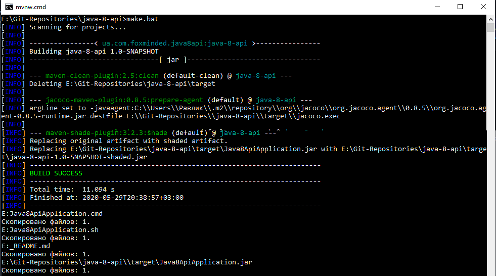
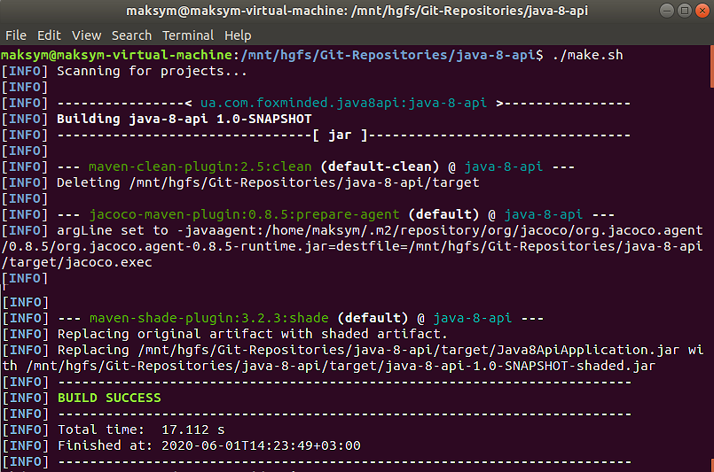
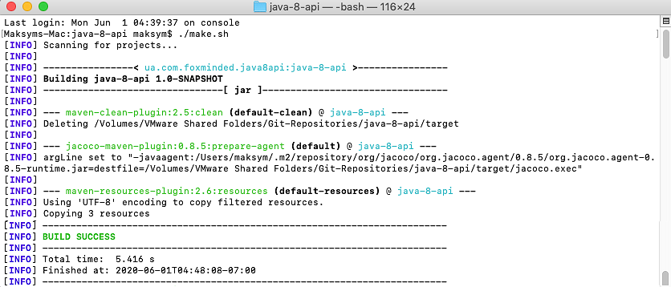
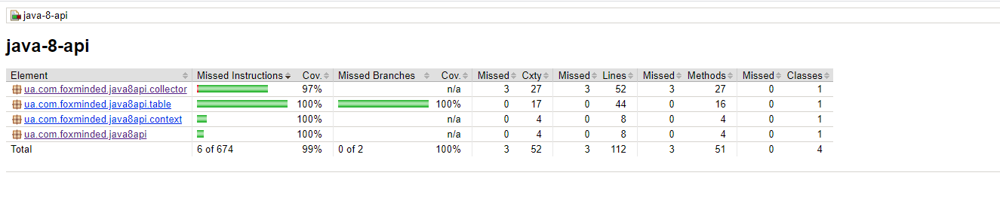

# Java 8 API (Tasks 6) 
## Table of content  
* [Task](#Task)
* [How to build](#How-to-build)
* [File Structure](#File-structure)
* [Dependencies](#Dependencies)
* [Technologies](#Technologies)
* [Information and links](#Information-and-links)
* [Tests coverage report](#Tests-coverage-report)

## Task  
There are 2 log files start.log and end.log that contain start and end data of the best lap for each racer of Formula 1 - Monaco 2018 Racing. (Start and end times are fictional, but the best lap times are true). Data contains only the first 20 minutes that refers to the first stage of the qualification.

Q1: For the first 20 minutes (Q1), all cars together on the track try to set the fastest time. The slowest seven cars are eliminated, earning the bottom grid positions. Drivers are allowed to complete as many laps as they want during this short space of time.

Top 15 cars are going to the Q2 stage. If you are so curious, you can read the rules here https://www.thoughtco.com/developing-saga-of-formula1-qualifying-1347189

The third file abbreviations.txt contains abbreviation explanations.

Parse hint:
SVF2018-05-24_12:02:58.917

SVF - racer abbreviation 
2018-05-24 - date
12:02:58.917 - time

Your task is to read data from 2 files, order racers by time and print report that shows the top 15 racers and the rest after underline, for example:
```
1. Daniel Ricciardo   | RED BULL RACING TAG HEUER | 1:12.013
2. Sebastian Vettel   | FERRARI                   | 1:12.415
3. ...
------------------------------------------------------------------------
16. Brendon Hartley   | SCUDERIA TORO ROSSO HONDA | 1:13.179
17. Marcus Ericsson   | SAUBER FERRARI            | 1:13.265
```

Use Java 8 API where appropriate.

**Notes:** Do not use loops!!!

## How to build:  
Make sure Java Development Kit (JDK) and Maven tool installed on your machine.

There are two options how to build project:

* Windows:
   
   - double-click on `make.bat`:
  

  
   - or use Command Prompt:  navigate to project's root folder and type `make.bat` command:


      
   - or use `mvnw.cmd package` command in Terminal (Maven Wrapper)
   
   - or use `mvn package` command in Terminal (Maven)
      
* Linux/MacOS:

   - execute `make.sh` script file by using `./make.sh` command:
      

      

   
   - or use `./mvnw package` command in Terminal (Maven Wrapper)
   
   - or use `mvn package` command in Terminal with Maven

`make.bat` and `make.sh` will create a `dist` folder with application execution jar, batch + bash files and _README file for users. 

## File structure 
```bash
├── src
|   ├── files
|   |   |-- abbreviations.txt
|   |   |-- end.log
|   |   └── start.log
|   |
│   ├── main
│   │   ├── java
|   |   |   |-- ua/com/foxminded/java8api
|   |   |   |   └── Main.java
|   |   |   |   
│   │   |   │── ua/com/foxminded/java8api/collector
│   │   |   │   └── DataCollector.java
│   │   |   │
│   │   |   │── ua/com/foxminded/java8api/context
│   │   |   │   └── Context.java
│   │   |   │
│   │   |   └── ua/com/foxminded/java8api/table
│   │   |       └── TableCreator.java
│   │   |
|   |   └── resources
|   |       └── files
|   |           |-- abbreviations.txt
|   |           |-- end.log
|   |           └── start.log
|   |           
│   └── test
│       └── java
|           |-- ua/com/foxminded/java8api
|           |   └── MainTest.java
|           |   
│           │── ua/com/foxminded/java8api/collector
│           │   └── DataCollectorTest.java
│           │
│           │── ua/com/foxminded/java8api/context
│           │   └── ContextTest.java
│           │
│           └── ua/com/foxminded/java8api/table
│               └── TableCreatorTest.java
|
├── docs
│   └── img
│       └── *.png
│-- target
├── .gitignore
├── make.bat
├── make.sh
|-- _README.md
└── README.md
```

## Dependencies: 
- JUnit Platform: junit-platform-console-standalone-1.6.0 ([download](https://mvnrepository.com/artifact/org.junit.platform/junit-platform-console-standalone/1.6.0))
- JUnit TestEngine API: junit-jupiter-api-5.6.0 ([download](https://mvnrepository.com/artifact/org.junit.jupiter/junit-jupiter-api/5.6.0))
- Mockito mocking framework for unit tests: mockito-all-1.10.19 ([download](https://mvnrepository.com/artifact/org.mockito/mockito-all/1.10.19))
- JaCoCo - Java Code Coverage Library 0.8.5 ([download](https://mvnrepository.com/artifact/org.jacoco/jacoco-maven-plugin/0.8.5))
- Maven Wrapper ([download](https://mvnrepository.com/artifact/io.takari/maven-wrapper))
- Maven Shade Plugin: maven-shade-plugin-3.2.3 ([download](https://apache.ip-connect.vn.ua/maven/plugins/maven-shade-plugin-3.2.3-source-release.zip))

## Technologies  Project is created with:
* Java EE 1.8
* Junit 5
* Maven

## Information and links 
- Java SE Runtime Environment 8 (JRE) ([download](https://www.oracle.com/technetwork/java/javase/downloads/jre8-downloads-2133155.html))
- Apache Maven ([download](https://maven.apache.org/download.cgi))
- Eclipse ([download](https://www.eclipse.org/downloads/))

## Tests coverage report
  