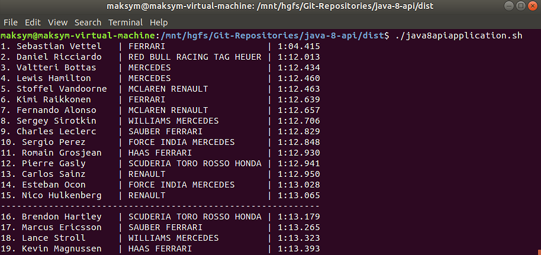
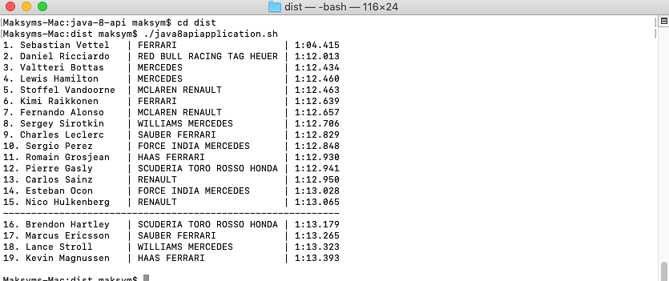
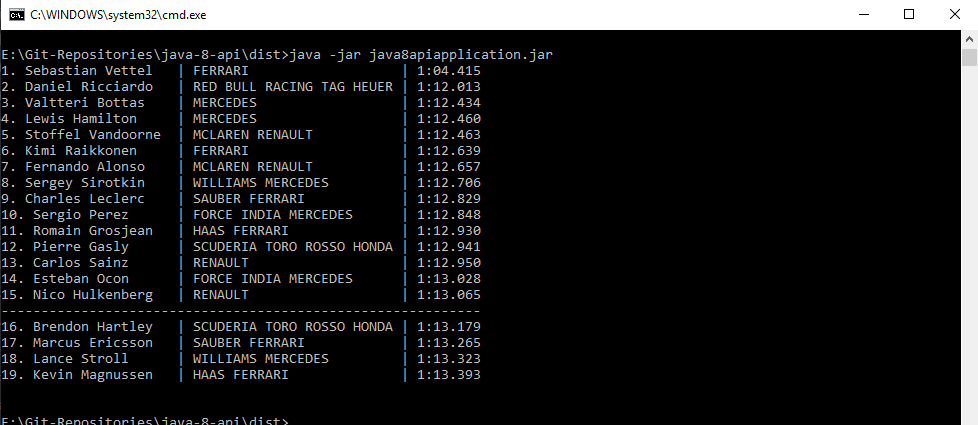
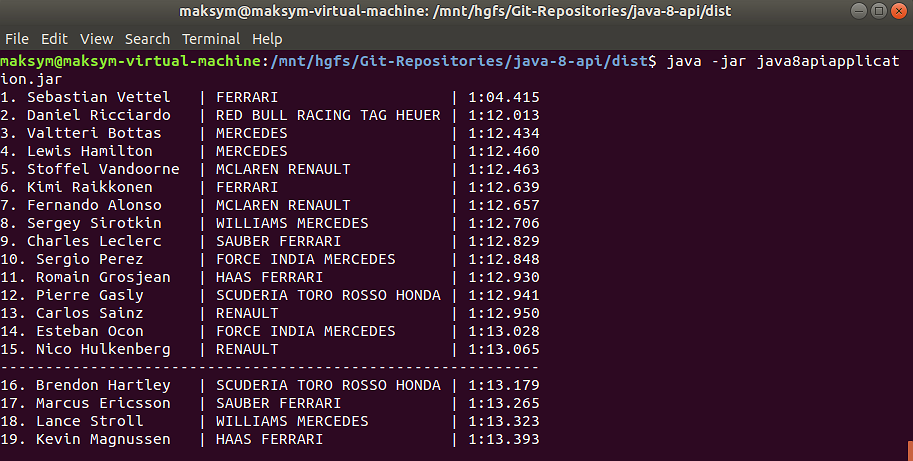
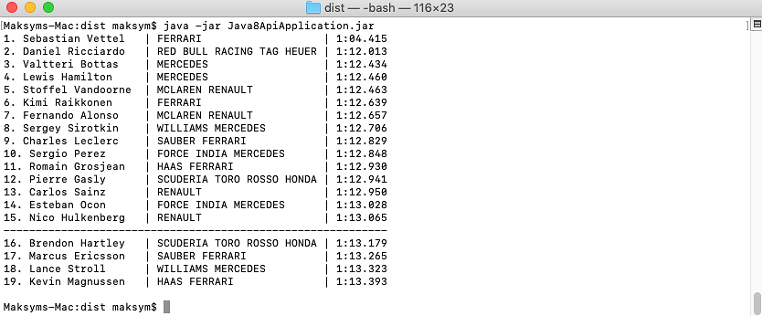

# Java8Api Application

## Description:

Application that reads information from the files and create final standings of the racers using the best lap time of each racer.
```
1. Daniel Ricciardo   | RED BULL RACING TAG HEUER | 1:12.013
2. Sebastian Vettel   | FERRARI                   | 1:12.415
3. ...
------------------------------------------------------------------------
16. Brendon Hartley   | SCUDERIA TORO ROSSO HONDA | 1:13.179
17. Marcus Ericsson   | SAUBER FERRARI            | 1:13.265
```

## How to run:

1. By using CollectionApplication script:

    By sending number of lines to be input and text arguments to batch script using command line:
     
     * In Windows:
        
     1) Open Command line
        
     2) Type `Java8ApiApplication.cmd` and press `Enter`

     >Notes:
     >* Make sure the `Java8ApiApplication.jar` is located at the same folder as `Java8ApiApplication.cmd`.

The result of successful application execution:


   * In Linux/MacOS:

     1) Open Terminal
        
     2) Type `Java8ApiApplication.sh` and press `Enter`
      
     >Notes:
     >* Make sure the `Java8ApiApplication.jar` is located at the same folder as `Java8ApiApplication.sh`.


The result of successful application execution in Linux:



The result of successful application execution in MacOS:



2. By using Java archive (JAR) file (from dist folder):

* in Windows:


	 
   
* in Linux:


     
* in MacOS:


